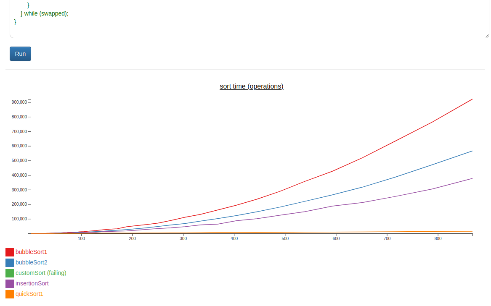

Hack-A-Day is a project I'm doing in November, where I try to make 30 new projects, in 30 days.

# Day 25: Hack-An-Experiment

Experimentally determine the big-O runtime and constants of algorithms.

Demo available [here](https://tilde.za3k.com/hackaday/experiment).

Source available on [github](https://github.com/za3k/day25_experiment).
